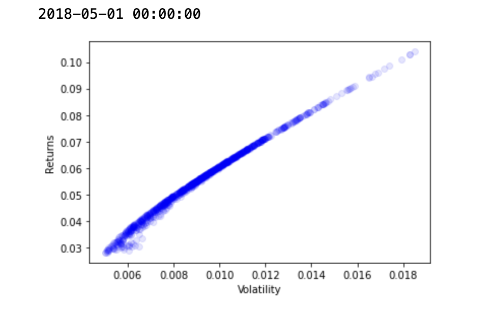
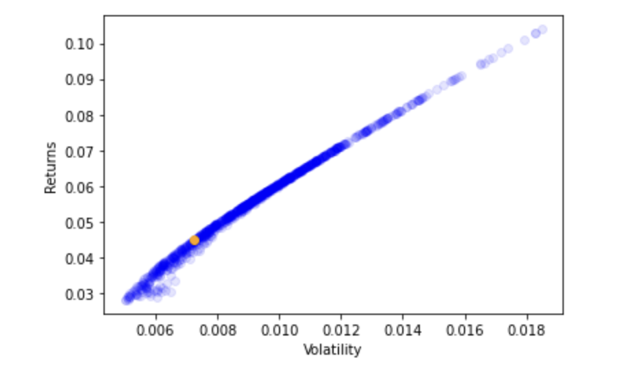
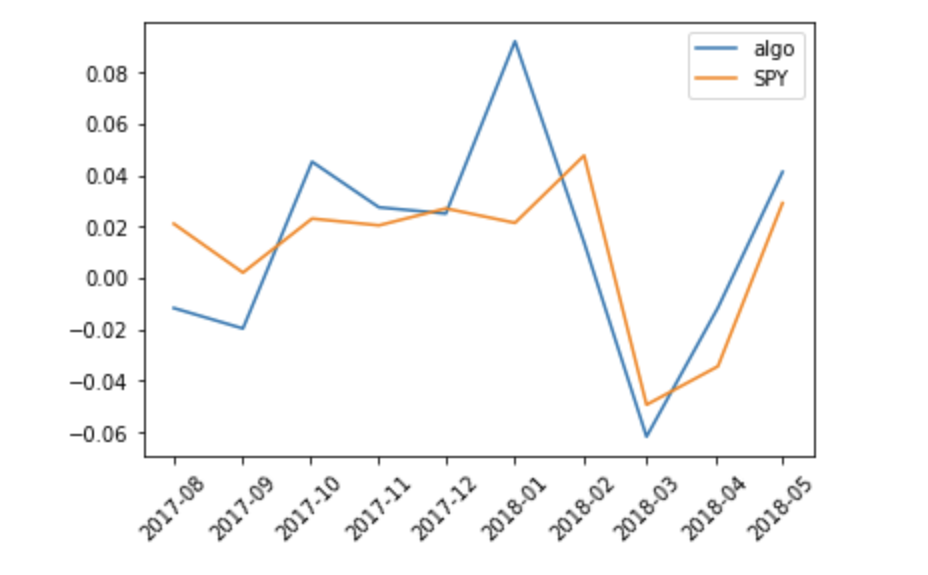

# ml-mpt-project

This project was accomplished using the labs and the resources provided by the [Machine Learning for Finance](https://app.datacamp.com/learn/courses/machine-learning-for-finance-in-python) course on DataCamp.

The project is about using Modern Portoflio Theory (MPT) and the Sharpe Ratio to predict optimal portfolios. A portfolio is a group of assets (such as stocks and bonds). MPT attempts to find ideal portfolios by quantifying risks and retuns. Returns are the percentage change in the stock's price while risk is quantified via volatility.

Three securities are used to form the dataset: LNG (Cheniere Energy Inc.'s stock), SMLV (Small Cap Low Volatility Index) and SPY (SPDR S&P 500 Trust ETF). In our ```full_df``` dataframe, each date has a stock price. We rebalance our portfolio dataset using the BMS (Business Month Start) timeframe where we assume stocks are sold and bought on the first day of each month. We then calculate daily returns of stocks stock for the first day of each month in ```returns_monthly``` datafrane. To calculate volatility, we first calculated the covariance between our stocks. Next, we generate 1000 random portfolios with random (normalised) weights for each stock. The volatility of each portoflio is calculated using the covariance of stocks and their respective weights. The volatilities and weights are stored in the respective dictionaries ```portfolio_volatility``` and ```portfolio_weights`` with BMS dates as keys. Plotting the volatility against returns for the latest date in the dataset gives us the efficient frontier for that date. The efficient frontier gives the returns for a given level of risk:



The best portfolio is selected according to the Sharpe ratio:


Here we assume a 0% risk free rate.

Looping through each BMS date, we calculate the sharpe ratio for each portfolio and append the index of the portfolio with highest Sharpe ratio to ```max_sharpe_idxs```. The weights of the portfolio's with highest Sharpe ratio are the targets of our ML model. The features are the exponentially-weighted moving averages (EWMA) of daily returns. This means recent returns are given a larger weight than older returns according to an exponential curve.

We replot the efficeint frontier for the latest date in the dataset marking the best portfolio with highest Sharpe ratio in orange:



With the features and targets created, we fit a Machine Learning model using Python's SciKit Learn library. Precisely, a random forest generating 300 trees was fit to the data and stored under the variable name ```rfr```. The R2 of the model on the training set is roughly 82% indicating a good predictive power.

Using the model's predicted weights, we calculate daily returns for the test set and sum the returns for each month. We then plot the monthly predicted returns and see how they compare to returns from investing into the SPY stock only:




Lastly, to graphically visualise predictions, we plot the 150th tree of our Random Forest Classifier. The predictions are expected to flatten out after the 100th tree. The tree estimator was visualised using Python's ```Graphviz``` library.


At every node of the tree, 4 parameters are evaluated and shown: A stock's daily return EWMA as features , the squared error, the sample size and the stock weights as targets.


